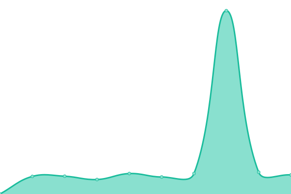

# [📈 Live Status](https://shaoyaoqian.github.io/uptime): <!--live status--> **🟩 All systems operational**

This repository contains the open-source uptime monitor and status page for [王璇](https://blog.pengfeima.cn), powered by [Upptime](https://github.com/upptime/upptime).

With [Upptime](https://upptime.js.org), you can get your own unlimited and free uptime monitor and status page, powered entirely by a GitHub repository. We use [Issues](https://github.com/shaoyaoqian/uptime/issues) as incident reports, [Actions](https://github.com/shaoyaoqian/uptime/actions) as uptime monitors, and [Pages](https://shaoyaoqian.github.io/uptime) for the status page.

<!--start: status pages-->
<!-- This summary is generated by Upptime (https://github.com/upptime/upptime) -->
<!-- Do not edit this manually, your changes will be overwritten -->
<!-- prettier-ignore -->
| URL | Status | History | Response Time | Uptime |
| --- | ------ | ------- | ------------- | ------ |
|  [Nginx 代理](https://proxy.pengfeima.cn) | 🟩 Up | [nginx.yml](https://github.com/shaoyaoqian/uptime/commits/HEAD/history/nginx.yml) | 

 843ms
     
 | 

<a href="https://shaoyaoqian.github.io/uptime/history/nginx">100.00%</a>
    

|  [Transmission](https://transmission.pengfeima.cn) | 🟩 Up | [transmission.yml](https://github.com/shaoyaoqian/uptime/commits/HEAD/history/transmission.yml) | 

 860ms
     
 | 

<a href="https://shaoyaoqian.github.io/uptime/history/transmission">100.00%</a>
    

|  [论坛](https://talk.pengfeima.cn) | 🟩 Up | [.yml](https://github.com/shaoyaoqian/uptime/commits/HEAD/history/.yml) | 

 655ms
     
 | 

<a href="https://shaoyaoqian.github.io/uptime/history/">100.00%</a>
    

|  [publications](https://publications.pengfeima.cn/publications) | 🟩 Up | [publications.yml](https://github.com/shaoyaoqian/uptime/commits/HEAD/history/publications.yml) | 

 384ms
     
 | 

<a href="https://shaoyaoqian.github.io/uptime/history/publications">100.00%</a>
    

|  [服务器监控](https://beszel.pengfeima.cn) | 🟩 Up | [.yml](https://github.com/shaoyaoqian/uptime/commits/HEAD/history/.yml) | 

 655ms
     
 | 

<a href="https://shaoyaoqian.github.io/uptime/history/">100.00%</a>
    

|  [简记](https://memory.pengfeima.cn) | 🟩 Up | [.yml](https://github.com/shaoyaoqian/uptime/commits/HEAD/history/.yml) | 

 655ms
     
 | 

<a href="https://shaoyaoqian.github.io/uptime/history/">100.00%</a>
    

|  [个人博客](https://blog.pengfeima.cn) | 🟩 Up | [.yml](https://github.com/shaoyaoqian/uptime/commits/HEAD/history/.yml) | 

 655ms
     
 | 

<a href="https://shaoyaoqian.github.io/uptime/history/">100.00%</a>
    

|  [个人主页](https://pengfeima.cn) | 🟩 Up | [.yml](https://github.com/shaoyaoqian/uptime/commits/HEAD/history/.yml) | 

 655ms
     
 | 

<a href="https://shaoyaoqian.github.io/uptime/history/">100.00%</a>
    

<!--end: status pages-->

[**Visit our status website →**](https://shaoyaoqian.github.io/uptime)

## 📄 License

- Powered by: [Upptime](https://github.com/upptime/upptime)
- Code: [MIT](./LICENSE) © [Anand Chowdhary](https://anandchowdhary.com), supported by [Pabio](https://pabio.com)
- Data in the `./history` directory: [Open Database License](https://opendatacommons.org/licenses/odbl/1-0/)
